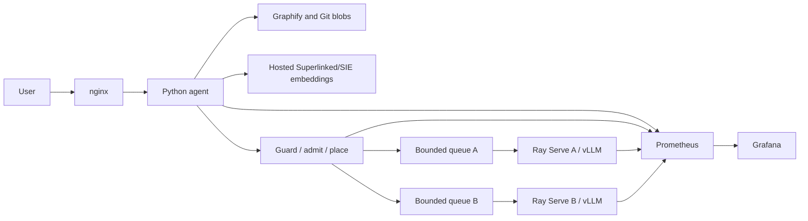

# GraphServe repository understanding agent

GraphServe accepts a public GitHub repository URL and a full commit SHA, builds
a Graphify code graph, retrieves and optionally reranks related source through a
hosted Superlinked/SIE endpoint, and returns explanations and change proposals with commit-pinned citations. It does
not execute repository code or apply proposed changes.

## Local development

```bash
python3 -m venv .venv
source .venv/bin/activate
pip install -r requirements.lock
pip install --no-deps -e .
cp .env.example .env
docker compose up --build
```

Local Compose uses mock inference while retaining real Git/Graphify ingestion.
Open `http://localhost:8080/docs`, click **Authorize**, and enter
`local-development-only` without a `Bearer` prefix. Swagger adds the prefix.

Submit `POST /repositories` with a GitHub URL and full 40-character SHA, then
use its `repository_id` in `POST /questions`.

## Architecture



The measured deployment uses one K3s control node and two A100 worker nodes,
with one whole-GPU Qwen2.5-Coder-7B-Instruct BF16 replica per worker. The
default deployment uses a hosted embeddings endpoint when `SIE_BASE_URL` and
`SIE_API_KEY` are set; `compose.sie.yaml` and `deploy/k8s/sie.yaml` remain
optional self-hosted profiles. Source IDs, blob contents and line ranges are verified; semantic entailment is not yet
automatically scored.

## Measured serving profiles

Configuration A uses default Ray routing with automatic prefix caching disabled.
Configuration B enables automatic prefix caching and prefix-affinity routing.
All 36 A requests succeeded; B timed out four concurrency-4 requests. The A/B
evidence is under `benchmarks/`, and `submission.ipynb` regenerates its tables
and charts.

## Commands and documentation

```bash
pytest -q
kubectl kustomize deploy/k8s > /tmp/repo-agent-rendered.yaml
```

- `docs/deployment.md`: three-node setup and persistence.
- `docs/three-node-prefix-routing.md`: model-worker topology and profiles.
- `docs/benchmarking.md`: benchmark method and recorded results.
- `docs/requirements-audit.md`: met, partial and open requirements.
- `docs/validation.md`: local and live validation evidence.
- `DESIGN.md`: model, KV and serving-design rationale.
- `submission.ipynb`: reproducible evidence analysis.

Current limitations include public repositories only, synchronous bounded-time
ingestion, non-streaming answers, no cross-node KV transfer, and no semantic
answer-quality score. The final orchestrated profiles require new measurements;
the committed A/B results predate explicit per-worker placement and queues.
