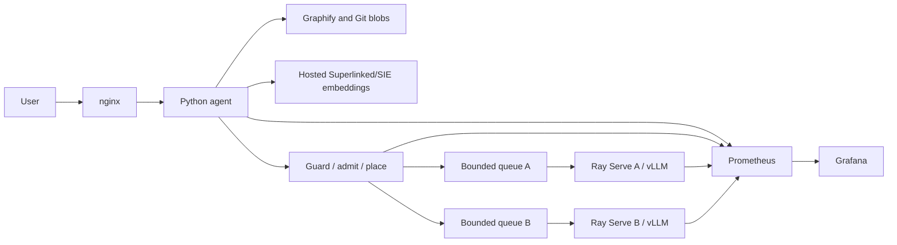

# GraphServe repository understanding agent

GraphServe accepts a public GitHub repository URL and a full commit SHA, builds
a Graphify code graph, retrieves and optionally reranks related source through a
hosted Superlinked/SIE endpoint, and returns explanations and change proposals with commit-pinned citations. It does
not execute repository code or apply proposed changes.

## Local development

```bash
python3 -m venv .venv
source .venv/bin/activate
pip install -r requirements.lock
pip install --no-deps -e .
cp .env.example .env
docker compose up --build
```

Local Compose uses mock inference while retaining real Git/Graphify ingestion.
Open `http://localhost:8080/docs`, click **Authorize**, and enter
`local-development-only` without a `Bearer` prefix. Swagger adds the prefix.

Submit `POST /repositories` with a GitHub URL and full 40-character SHA, then
use its `repository_id` in `POST /questions`.

## Architecture



The measured deployment uses one K3s control node and two A100 worker nodes,
with one whole-GPU Qwen2.5-Coder-7B-Instruct BF16 replica per worker. The
default deployment uses a hosted embeddings endpoint when `SIE_BASE_URL` and
`SIE_API_KEY` are set; `compose.sie.yaml` and `deploy/k8s/sie.yaml` remain
optional self-hosted profiles. Source IDs, blob contents and line ranges are verified; semantic entailment is not yet
automatically scored.

## Two-worker cluster benchmark configurations

The measured A/B comparison used one control node and two A100 40 GB GPU
workers. A shared RayService managed two complete model replicas, one per GPU
node. A single RayService did **not** mean a single worker. These October 1
measurements predate the current gateway-selected worker `a`/`b` topology.

| Setting | A — P2C, cache OFF | B — affinity, cache ON |
|---|---|---|
| Request router | Ray Serve Power of Two Choices (P2C), with no custom router configured | Ray `PrefixCacheAffinityRouter` |
| Selection policy | Samples two replicas and favors the one with fewer ongoing requests | Prefers matching prefixes when load permits; falls back to load balancing when imbalanced |
| vLLM automatic prefix caching | Disabled | Enabled |
| Prefix-router thresholds | Not configured | `imbalanced_threshold=2`, `match_rate_threshold=0.1` |
| Model replicas | 2 on separate GPU nodes | 2 on separate GPU nodes |
| Ray maximum ongoing requests | 8 per replica | 8 per replica |

Both used Ray 2.58.0 and Qwen2.5-Coder-7B-Instruct in BF16, with
`tensor_parallel_size=1`, `max_model_len=8192`, `max_num_seqs=8`, and
`gpu_memory_utilization=0.9`. See the saved
[A manifest](benchmarks/config-a-multinode-default/rayservice.yaml),
[B manifest](benchmarks/config-b-multinode-prefix-aware/rayservice.yaml), and
[Ray routing-policy documentation](https://docs.ray.io/en/latest/serve/llm/architecture/routing-policies.html).
These describe configured policies, not a recovered per-request routing trace.

## Reading the measured results

The stress client sent questions through the complete `/questions` workflow:
retrieval, SIE, prompt assembly, serving, and source verification.

| Column | Meaning |
|---|---|
| Configuration | A: P2C routing with prefix caching OFF. B: prefix-affinity routing with prefix caching ON. |
| C | Client concurrency: maximum simultaneous requests, not GPU count. |
| Success | Successful requests out of 12 measured requests in the phase. |
| Requests/s | Successful completions divided by total phase duration, including time spent waiting for failures. |
| p50 (s) | Median successful-request end-to-end latency. |
| p95 (s) | Interpolated 95th percentile of successful-request latency; uncertain with this small sample. |
| Tokens/s | Recorded input plus output tokens, including recorded retry usage, divided by phase duration. Not decode-only token speed or hidden work from failed calls. |

| Configuration | C | Success | Requests/s | p50 (s) | p95 (s) | Tokens/s |
|---|---:|---:|---:|---:|---:|---:|
| A — P2C, cache OFF | 1 | 12/12 | 0.138 | 6.38 | 11.13 | 738 |
| A — P2C, cache OFF | 2 | 12/12 | 0.285 | 6.46 | 10.73 | 1524 |
| A — P2C, cache OFF | 4 | 12/12 | 0.492 | 6.62 | 12.06 | 2633 |
| B — affinity, cache ON | 1 | 12/12 | 0.143 | 6.15 | 10.75 | 765 |
| B — affinity, cache ON | 2 | 12/12 | 0.272 | 5.78 | 13.41 | 1459 |
| B — affinity, cache ON | 4 | 8/12 | 0.038 | 43.60 | 80.92 | 199 |

**Configuration A handled increasing concurrency well in this run.** From C=1
to C=4, throughput increased approximately 3.6 times while median latency stayed
near 6.4–6.6 seconds. All 36 measured requests succeeded. At 0.492 requests/s,
the system averaged one completion every 2.03 seconds, even though individual
requests took about 6.62 seconds at the median, because requests overlapped.

**Configuration B was comparable at low concurrency but degraded at C=4.**
At C=1 it was slightly faster, without enough evidence to establish an advantage.
At C=2 its median was lower but its p95 was higher. At C=4 only eight of twelve
requests succeeded; those successes had 43.60-second median latency and
80.92-second p95. Four requests returned HTTP 502 after upstream timeouts.
Failed requests are excluded from latency percentiles, but their waiting time
contributes to phase duration and therefore reduces successful throughput.

A was more reliable and sustained better throughput at C=4 in this experiment.
This does **not** establish that prefix caching caused B's degradation: routing
and caching both changed, and there was only one short run per configuration.

## Current orchestration evidence and inference metrics

The newer deployment exposes stable worker endpoints and moves placement into
the Python gateway. Its `baseline` and `prefix-cache` profiles keep the same
gateway policy and differ only in the vLLM prefix-caching flag. They must be
measured separately from the A/B experiment above.

The available [orchestrated baseline run](benchmarks/config-a-orchestrated/run-1/summary.json)
contains **13 successes and 23 `tenant_tokens` rejections** across 36 measured
requests. Successful final-response metadata identifies worker `b`; this run
does not demonstrate balanced two-worker capacity. Adjacent phases shared a
tenant budget. Treat it as admission-control evidence rather than a clean
capacity comparison. The separate live smoke report demonstrates calls reaching
both workers.

[submission.ipynb](submission.ipynb) presents cluster-only results, the metric
reference, conclusions, and saved live smoke checks. It reports aggregate engine
TTFT and E2E latency, gateway queue wait, KV usage, GPU utilization/memory, and
engine/Serve queues where samples exist. Telemetry maxima are labeled as such;
they are not phase averages. Saved TPOT queries have no usable samples, and
per-request streaming TTFT and inter-token latency have not been collected.
Same-worker affinity does not by itself prove a prefix-cache hit.

## Commands and documentation

```bash
.venv/bin/python -m pytest -q
kubectl kustomize deploy/k8s > /tmp/repo-agent-rendered.yaml
```

- `docs/deployment.md`: three-node setup and persistence.
- `docs/three-node-prefix-routing.md`: model-worker topology and profiles.
- `docs/benchmarking.md`: benchmark method and recorded results.
- `docs/requirements-audit.md`: met, partial and open requirements.
- `docs/validation.md`: local and live validation evidence.
- `DESIGN.md`: model, KV and serving-design rationale.
- `submission.ipynb`: reproducible evidence analysis.

Current limitations include public repositories only, synchronous bounded-time
ingestion, non-streaming answers, no cross-node KV transfer, and no semantic
answer-quality score. The final orchestrated profiles require repeated, controlled A/B measurements;
the original A/B comparison predates explicit per-worker placement and queues.
